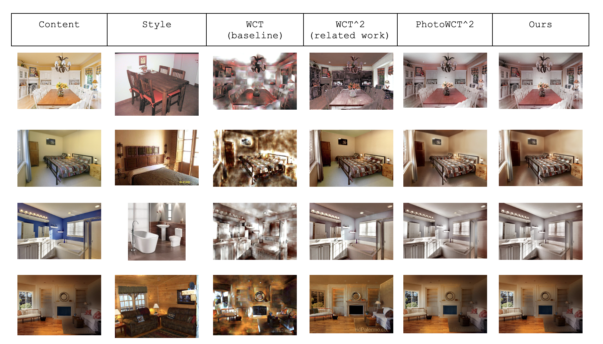

*Note: Readme and code adapted from [PhotoWCT2](https://github.com/chiutaiyin/PhotoWCT2)
# Room style transfer: 



## Models and files
We apply BFA to the following model:
A pre-trained VGG-19 encoder (from input layer to **relu41** layer; fixed during training) and a blockwisely trained decoder which can reproduce the **relu31**, **relu21**, **relu11** features and the input image. The ZCA transformations are embedded at the bottleneck and the reproduced reluN1 layers in the decoder.
    - The model is in ```utils/model_relu.py``` and the associated checkpoint is in ```ckpts/ckpts-relu```.
    - A demo that uses this model to stylize example images in ```figures/``` is shown in ```relu_demo.ipynb```. The resulting stylized images are in ```results/```.

Stylization with both models requires guided filtering in ```utils/photo_gif.py``` as the post-processing. The file is adapted from the one used in the [PhotoWCT code](https://github.com/NVIDIA/FastPhotoStyle).

## Stylize images
To stylize a room put the content room images in ```figures/content``` and the style images in ```figure/style``` then run ```relu_demo.ipynb```

## Training
```train.py``` is the training code for our model. The usage is provided in the file.

## Requirements 
- tensorflow v2.0.0 or above (we developed the models with tf-v2.4.1 and we also tested them in tf-v2.0.0)

## Citation
**PhotoWCT2: Compact Autoencoder for Photorealistic Style Transfer Resulting from Blockwise Training and Skip Connections of High-Frequency Residuals** published in WACV 2022.
